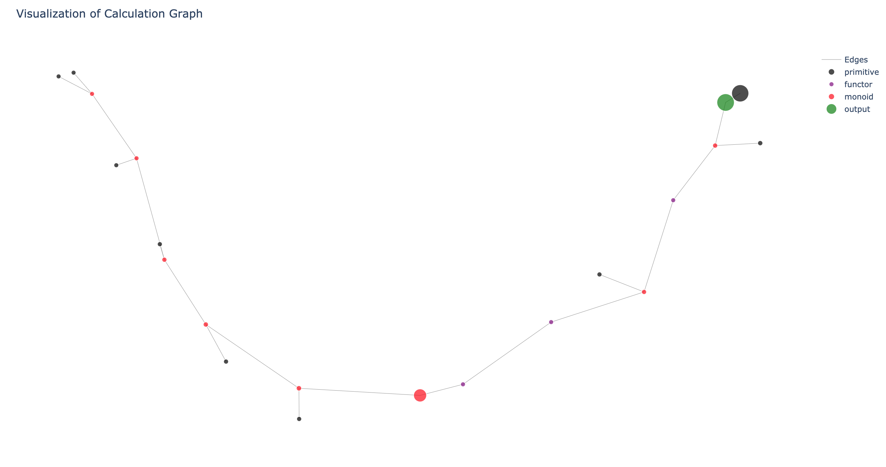

[](https://travis-ci.com/JonasRSV/tensor-jo)


---

A tiny tensor library written in python


## Content
---

- [Installation](#installation)
- [Test](#test)
- [Examples](#examples)
  - [Linear Regression](#linear-regression)
  - [Logistic Regression](#logistic-regression)
  - [Cache](#cache)
  - [Visualization](#visualization)

## What is this?
---

An implementation of a computational graph that support differentiating everything. Specific functionality includes

* Cache'ing of forward propagations in the graph
* Cache'ing of gradient computations in the graph
* Visualization of the graph
* Dynamically adding and removing entities in the graph

Please see the Examples section for examples

## What it is not

This is not a library for making huge computational graphs. Because of the nature of the implementation of the graph it is limited by the stack size. In python the stack size can be increased as follows:

```python3
import sys
sys.setrecursionlimit(A-NUMBER-HERE)
```

But either way this should not be used for large graphs.


## Installation
---

```bash
> git clone https://github.com/JonasRSV/tensor-jo.git
> cd tensor-jo
> python3 setup.py install
```


## Test
---

```bash
> pytest .
```


## Examples

### Linear Regression

---

```python
import tensorjo as tj
import numpy as np
x = np.arange(0, 10)
y = x + 5

# Variables
a = tj.var(np.random.rand())
b = tj.var(np.random.rand())

err = tj.mse(y, a * x + b)

print("before training: coefficient %s -- bias: %s -- mse: %s" %
      (a, b, err.output()))

# Updating manually
for i in range(1200):
    g = tj.gradients(err, [a, b])

    a.update(a.v - np.mean(g[0]) * 1e-2)
    b.update(b.v - np.mean(g[1]) * 1e-2)

print("after training: coefficient %s -- bias: %s -- mse: %s" % (a, b,
                                                                 err.output()))

## Or use a builtin optimiser

# Variables
a = tj.var(np.random.rand())
b = tj.var(np.random.rand())

print("before training: coefficient %s -- bias: %s -- mse: %s" %
      (a, b, err.output()))

err = tj.mse(y, a * x + b)

opt = tj.opt.gd(err)
opt.rounds = 1200

opt.minimise([a, b])

print("after training: coefficient %s -- bias: %s -- mse: %s" % (a, b,
                                                                 err.output()))
```

output

```bash
before training: coefficient 0.59156036 -- bias: 0.27047655 -- mse: 44.50837
after training: coefficient 1.0008107 -- bias: 4.994916 -- mse: 7.4838827e-06
before training: coefficient 0.10065077 -- bias: 0.08387766 -- mse: 7.4838827e-06
after training: coefficient 1.0008298 -- bias: 4.9947963 -- mse: 7.839944e-06<Plug>_
```

### Logistic Regression

---

```python
import tensorjo as tj
import numpy as np


def sigmoid(x):
    """Sigmoid function."""
    return 1 / (1 + np.exp(-x))


x = np.random.rand(10) - 0.5
y = sigmoid(4 * x - 1)

# Variables
a = tj.var(np.random.rand())
b = tj.var(np.random.rand())

o = tj.sigmoid(a * x + b)
err = tj.mse(y, o)

print("before training: coefficient %s -- bias: %s -- mse: %s" %
      (a, b, err.output()))

# Updating manually
for i in range(5000):
    g = tj.gradients(err, [a, b])

    a.update(a.v - np.mean(g[0]) * 1e-0)
    b.update(b.v - np.mean(g[1]) * 1e-0)

print("after training: coefficient %s -- bias: %s -- mse: %s" % (a, b,
                                                                 err.output()))

## Or use a builtin optimiser

# Variables
a = tj.var(np.random.rand())
b = tj.var(np.random.rand())

print("before training: coefficient %s -- bias: %s -- mse: %s" %
      (a, b, err.output()))

o = tj.sigmoid(a * x + b)
err = tj.mse(y, o)

opt = tj.opt.gd(err)
opt.rounds = 5000
opt.dt = 1e-0

opt.minimise([a, b])

print("after training: coefficient %s -- bias: %s -- mse: %s" % (a, b,
                                                                 err.output()))
```

output

```bash
before training: coefficient 0.8239656 -- bias: 0.9479227 -- mse: 0.24330702
after training: coefficient 3.9844732 -- bias: -1.0001798 -- mse: 1.2030186e-07
before training: coefficient 0.81145114 -- bias: 0.68252563 -- mse: 0.19009504
after training: coefficient 3.984306 -- bias: -1.0001817 -- mse: 1.229045e-07
```

### Cache

---

```python3
import tensorjo as tj
import numpy as np
import time
import sys

print("Testing if cache makes a difference performance wise.")
"""Make a loong graph."""
a = tj.var(np.random.rand())
b = tj.var(np.random.rand())

sys.setrecursionlimit(5000)

timestamp = time.time()
c = a + b
for _ in range(2000):
    c = a + b + c

print("Making graph with %s ops took %s seconds" % (3 * 2000,
                                                    time.time() - timestamp))

iters = 200

timestamp = time.time()
for _ in range(iters):
    c.output()

print("Running %s iters without cache took %s seconds" %
      (iters, time.time() - timestamp))

timestamp = time.time()
tj.tjgraph.cache()

print("Cacheing graph took %s seconds" % (time.time() - timestamp))

timestamp = time.time()
for _ in range(iters):
    c.output()

print("Running %s iters with cache took %s seconds" %
      (iters, time.time() - timestamp))

# Since the entire graph is dependant on
# a this will probably be slower than running
# updates without cache.

# But if you are training for example "part of a graph"
# this can potentially give massive speedups! :)
timestamp = time.time()
for _ in range(iters):
    a.update(np.random.rand())
    c.output()

print("Running %s iters with cache and update took %s seconds" %
      (iters, time.time() - timestamp))

tj.tjgraph.no_cache()

timestamp = time.time()
for _ in range(iters):
    a.update(np.random.rand())
    c.output()

print("Running %s iters with no cache and update took %s seconds" %
      (iters, time.time() - timestamp))
```

output
```bash
Testing if cache makes a difference performance wise.
Making graph with 6000 ops took 0.07345104217529297 seconds
Running 200 iters without cache took 1.0803160667419434 seconds
Cacheing graph took 0.007400035858154297 seconds
Running 200 iters with cache took 0.007011890411376953 seconds
Running 200 iters with cache and update took 1.3192110061645508 seconds
Running 200 iters with no cache and update took 1.0495119094848633 seconds
```


## Visualization

---

The computational graph can be visualized. Plotly is used under the hood so the plots
is interactive.


```python3
from tensorjo import viz
import tensorjo as tj
import numpy as np

a = tj.var(np.random.rand())
b = tj.var(np.random.rand())
c = tj.var(np.random.rand())

d = a + b + c
d = d + 5
d = d + 5
d = d + 5
d = d * d
d = tj.sigmoid(d)
d = tj.sin(d)
d = 5 + d
d = tj.cos(d)
d = d * 10 + 400

v = viz.visualizer(tj.tjgraph)

v.draw(d)
```


